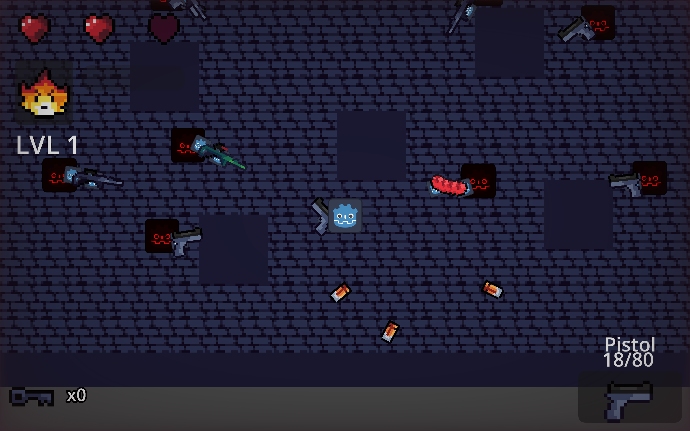
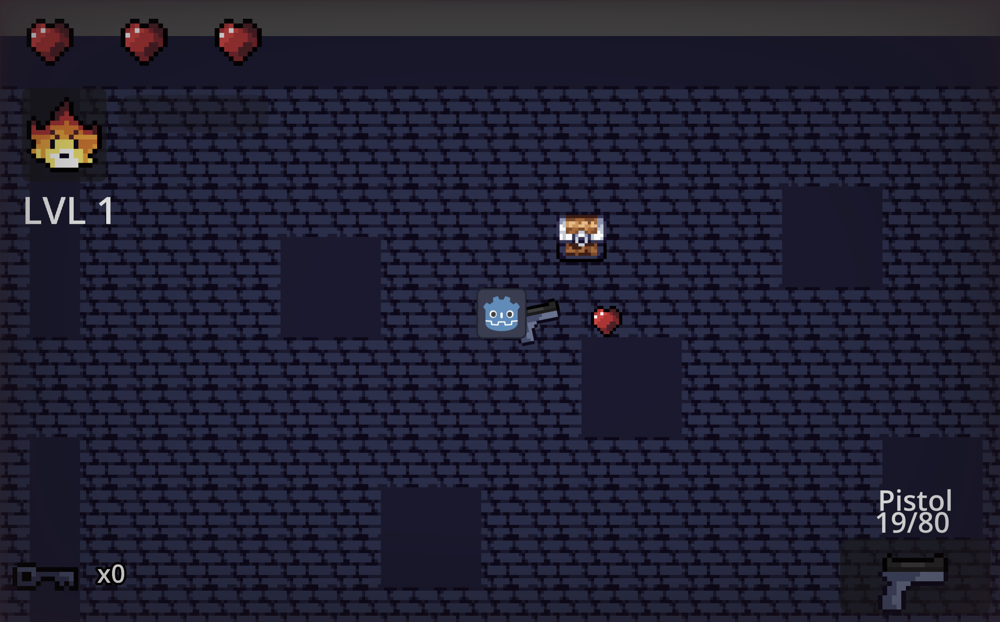

# Soulsyche
###### A dungeon crawler bullet hell, where you have to clear all rooms of the dungeon in order to beat the game.

Demo -  https://xpuv.itch.io/soulsyche

##### Features

* Procedurally generated dungeon rooms
* Multiple enemy types ( sniper, pistol, shotgun, assault rifle ) 
* Different weapons with unique stats
* Soul ability system

##### Controls

WASD - Movement

Mouse - Aiming

Left Mouse Button - Shoot

Right Mouse Button - Ability

R - Reload

Dash - Space

Interact ( Open Chest ) - E

##### Techincal Overview

This game is heavily reliant on composition over inheritance, where several components and modules work together to make certain behaviours.

###   Room Generation
I created my own algorithm for generating rooms! Randomly, a vector map of the directions ( left, right, up and down ) is created, and
a direction is randomly chosen and set to a map. Then, rooms are allocated to said position in real world space and are placed so that they have overlapping walls. After that, the doors are added, which allow for passing in and out of rooms - linking between the two rooms they are connected to so that you can use them on either side. There's also a chance that a room may spawn with a chest ( of varying rarity ), or more enemies!

### Weapon Management

  
I was also very proud of the gun system. All entities use simiar/same components in order to use the guns, with just slightly modified data in order to allow for varying behaviour. The same shooter component in the player is used in every enemy, just with different setups of the GunInstance class to allow for no need to reload. The varying data as well is cool because it allowed for me to quickly edit the value of things if they didnt feel

Examples of other systems are:

* Player movement and combat
* UI
* Enemy spawning

##### Credits

Developed by andwoo ( Andrew ) for Stardance 2026.

Used ChatGPT for helping to plan out and design systems. 

Future improvements

Art and SFX 
More souls

A boss fight

